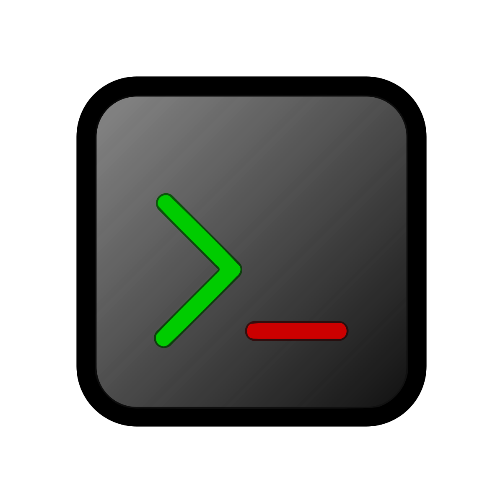

# Cathode

    

    <strong>
        A terminal-centric replacement for System.Console.
    </strong>

---

Cathode is a toolkit for writing terminal-based applications. It is effectivel
a complete replacement for System.Console.

With the Windows console host now supporting virtual terminal sequences, it
makes little sense for console interaction to still be centered around the old
Windows console host and the many limitations it had. Cathode provides an API
centered around a [VT100 terminal](https://vt100.net) with some extensions from
later models and modern terminal emulators. It works on all desktop platforms
that .NET 6+ supports.

Please note that, since Cathode replaces a very fundamental component of the
framework, the use of certain framework APIs becomes problematic. As an example,
intermixing Cathode and System.Console usage *will* break. Referencing Cathode
(or a package that uses it) will pull in a Roslyn analyzer which will diagnose
problematic APIs and suggest working replacements.

## Usage

This project offers the following packages:

| Package | Description | Downloads |
| -: | - | :- |
| [![Cathode][core-img]][core-pkg] | Provides the core terminal API. | ![Downloads][core-dls] |
| [![Cathode.Analyzers][analyzers-img]][analyzers-pkg] | Provides diagnostic analyzers and source generators. | ![Downloads][analyzers-dls] |
| [![Cathode.Hosting][hosting-img]][hosting-pkg] | Provides the terminal hosting model. | ![Downloads][hosting-dls] |
| [![Cathode.Extensions][extensions-img]][extensions-pkg] | Provides terminal hosting and logging for the .NET Generic Host. | ![Downloads][extensions-dls] |

[core-pkg]: https://www.nuget.org/packages/Cathode
[analyzers-pkg]: https://www.nuget.org/packages/Cathode.Analyzers
[hosting-pkg]: https://www.nuget.org/packages/Cathode.Hosting
[extensions-pkg]: https://www.nuget.org/packages/Cathode.Extensions

[core-img]: https://img.shields.io/nuget/v/Cathode?label=Cathode
[analyzers-img]: https://img.shields.io/nuget/v/Cathode.Analyzers?label=Cathode.Analyzers
[hosting-img]: https://img.shields.io/nuget/v/Cathode.Hosting?label=Cathode.Hosting
[extensions-img]: https://img.shields.io/nuget/v/Cathode.Extensions?label=Cathode.Extensions

[core-dls]: https://img.shields.io/nuget/dt/Cathode?label=
[analyzers-dls]: https://img.shields.io/nuget/dt/Cathode.Analyzers?label=
[hosting-dls]: https://img.shields.io/nuget/dt/Cathode.Hosting?label=
[extensions-dls]: https://img.shields.io/nuget/dt/Cathode.Extensions?label=

To install a package, run `dotnet add package <name>`.

See the [sample programs](src/samples) for examples of what the API can do. The
samples can be run with
[`dotnet example`](https://github.com/patriksvensson/dotnet-example).

## Terminals

This project aims to have excellent support for the following terminal
emulators:

* [Alacritty](https://github.com/alacritty/alacritty)
* [ConEmu](https://conemu.github.io)
* [foot](https://codeberg.org/dnkl/foot)
* [GNOME Terminal](https://help.gnome.org/users/gnome-terminal/stable)
* [iTerm2](https://iterm2.com)
* [kitty](https://sw.kovidgoyal.net/kitty)
* [Konsole](https://konsole.kde.org)
* [mintty](https://mintty.github.io)
* [mlterm](http://mlterm.sourceforge.net)
* [PuTTY](https://www.putty.org)
* [rxvt-unicode](http://software.schmorp.de/pkg/rxvt-unicode.html)
* [Terminal.app](https://support.apple.com/guide/terminal/welcome/mac)
* [Terminology](https://terminolo.gy)
* [WezTerm](https://wezfurlong.org/wezterm)
* [Windows Console](https://docs.microsoft.com/en-us/windows/console)
* [Windows Terminal](https://aka.ms/terminal)
* [xterm](https://invisible-island.net/xterm)

(Even if you are using a terminal emulator that is not listed here, chances are
that it will work just fine; these are just the ones that are tested regularly
while developing Cathode.)
